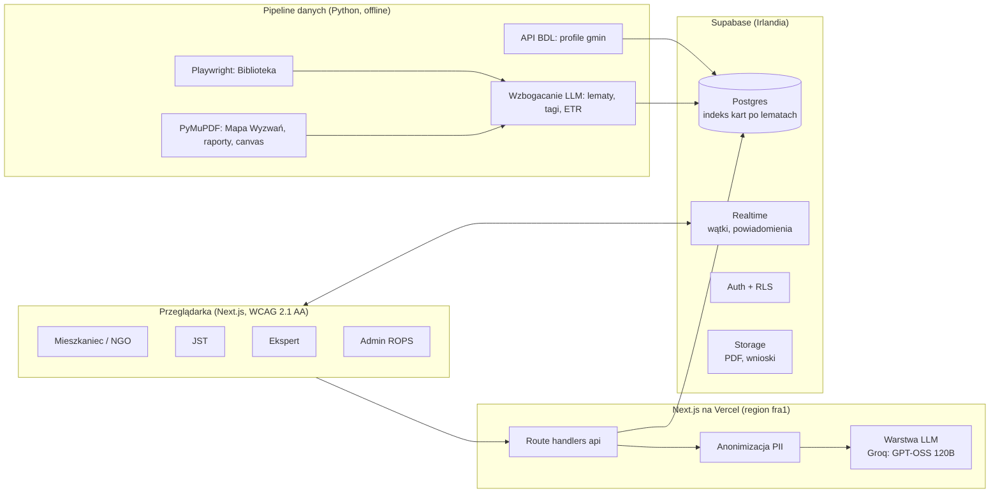
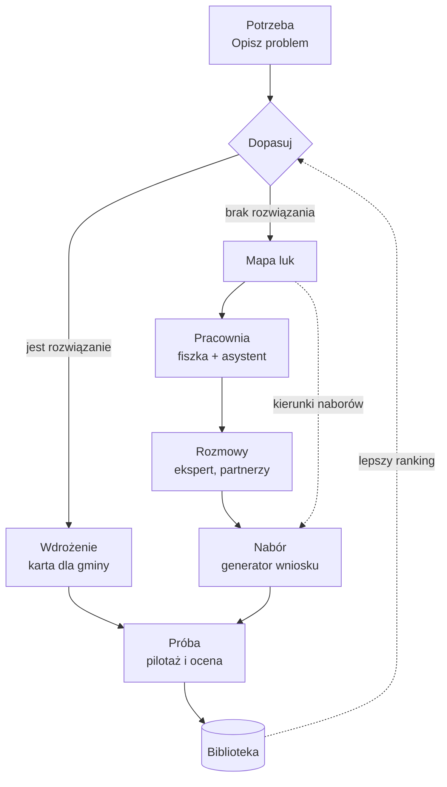
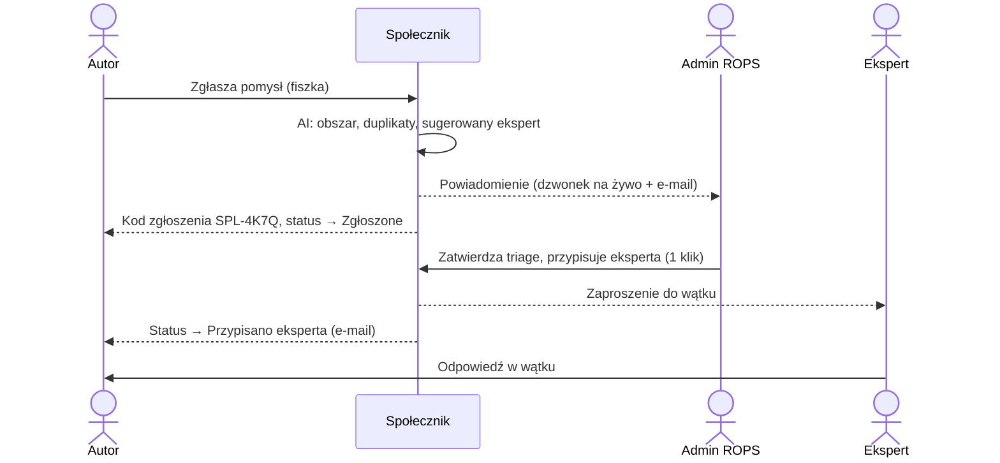

# Społecznik — cyfrowe serce Małopolskiego Hubu Innowacji Społecznych

Plan hackathonowy · HackYeah 2026 · wyzwanie ROPS Kraków
Stan na: sobota 3.10.2026, ~15:15. Kodowanie kończy się w niedzielę o 11:00.

---

## TL;DR

- **Nazwa:** **Społecznik**. Hasło: *Łączymy potrzeby Małopolski z rozwiązaniami, które już działają.*
- **Idea:** każda potrzeba, innowacja, pomysł, ekspert i nabór to „karta”. Jeden silnik dopasowań (wyszukiwanie hybrydowe + rerank LLM z uzasadnieniem) splata karty ze sobą. Siedem modułów z briefu to widoki i akcje na tym samym grafie, a nie siedem osobnych aplikacji.
- **Stack:** Next.js + TypeScript + Tailwind + shadcn/ui (Vercel) · Supabase (Postgres + Auth + Realtime + Storage) · cały AI na Groq (`openai/gpt-oss-120b`) za wymiennym interfejsem `lib/llm.ts` · Python (Playwright, PyMuPDF) do jednorazowego pipeline'u danych · API BDL GUS do profili gmin.
- **Co jest nowe:**
  1. mapa luk innowacyjnych (potrzeby bez rozwiązań → kierunki naborów),
  2. dopasowanie z kontekstem terytorialnym gminy,
  3. matching w obie strony (potrzeba ↔ innowacja ↔ pomysł ↔ ekspert ↔ nabór),
  4. dostępność jako rdzeń: głos, tekst łatwy do czytania, status zgłoszenia jak śledzenie paczki.
- **Kluczowe godziny:** zgłoszenie robocze ok. 19:30 (jeśli wymagane), feature freeze 9:30, zgłoszenie końcowe 10:30.

---

## 1. Nazwa i koncepcja

**Społecznik** to ktoś, kto działa na rzecz swojej społeczności. Serwis ma robić to samo: łączyć ludzi, potrzeby i rozwiązania.

Alternatywy:
- **Zaczyn** — mała porcja, która zakwasza całe ciasto; mikroinnowacje skalowane na cały region.
- **Społeczny Swat** — dosłownie matchmaking, w bardziej żartobliwym tonie.

**Zasada nazewnictwa:** nazwy modułów służą do pitchu. W interfejsie używamy prostych czasowników, bo jury ocenia intuicyjność dla osób o niskich kompetencjach cyfrowych.

| Moduł z briefu | Nazwa w pitchu | Etykieta w UI |
|---|---|---|
| I. Matchmaking społeczny (obligatoryjny) | Społecznik·Dopasuj | „Opisz problem” |
| II. Zasobnik wiedzy | Społecznik·Wiedza | „Biblioteka i wiedza” |
| III. Kreator pomysłów | Społecznik·Pracownia | „Zgłoś pomysł” |
| IV. Tester innowacji | Społecznik·Próba | „Przetestuj rozwiązanie” |
| V. Platforma komunikacji | Społecznik·Rozmowy | „Zapytaj eksperta” |
| VI. Panel administratora | Społecznik·Panel | (tylko dla ROPS) |
| VII. Middleman Innowacji | Społecznik·Wdrożenie | „Jak to wdrożyć u nas?” |

---

## 2. Dane: co faktycznie mamy

| Źródło | Co zawiera | Format | Użycie w Społeczniku |
|---|---|---|---|
| [Biblioteka Innowacji Społecznych](https://rops.krakow.pl/innowacje-spoleczne/biblioteka-innowacji-spolecznych/kategorie) | Innowacje w 9 kategoriach (szczegóły niżej). Każda strona ma te same sekcje: *1. Na czym polega rozwiązanie? · 2. Jakich problemów dotyczy? · 3. Grupa docelowa · 4. Kto może skorzystać?* Do tego PDF-karty modeli z sekcjami *Skąd wiemy, że działa? · Jak skorzystać? · Składowe innowacji*. | HTML, adresy `…/biblioteka-innowacji-spolecznych/{kategoria},{slug}` + PDF | Główny korpus dopasowań. Strukturę wyciągamy prawie za darmo, bo sekcje są stałe. |
| [Mapa Wyzwań Społecznych](https://rops.krakow.pl/mpliki/IS/IWS_20/za._nr_2._Mapa_Wyzwa_Spoecznych.pdf) | 8 obszarów: rodzina i piecza zastępcza, bezdomność, niepełnosprawność, ubóstwo, integracja cudzoziemców, zdrowie, zdrowie psychiczne, seniorzy. Każdy z definicją i listą wyzwań. **Dane są ogólnopolskie.** | PDF (~8 MB) | Oś 1 taksonomii, opisy obszarów w Zasobniku |
| [Internetowy Obserwator Statystyk Społecznych](https://obserwator.rops.krakow.pl/) | Wskaźniki na poziomie gmin i powiatów od 2007 r. (demografia, pomoc społeczna, zdrowie, rynek pracy). Eksport CSV oraz „Portret gminy” w XLS. Źródła m.in. BDL GUS. | Dashboard + CSV/XLS | Profil gminy (kontekst terytorialny), mapa „Kondycja Małopolski” |
| [API BDL GUS](https://api.stat.gov.pl/Home/BdlApi) | Te same typy danych przez REST/JSON, do poziomu gminy | JSON | Automatyczne pobranie profili wszystkich 183 gmin (od 1.01.2025, po wydzieleniu gminy Szczawa) |
| [Raporty z badań](https://rops.krakow.pl/badania-analizy-raporty/raporty-z-badan) | Np. Ocena zasobów pomocy społecznej, raport o DPS 2025 | PDF | RAG dla „Zapytaj Bibliotekę” + karty faktów w Zasobniku |
| [Publikacje ze świata innowacji](https://rops.krakow.pl/innowacje-spoleczne/publikacje-ze-swiata-innowacji) | Materiały edukacyjne | HTML/PDF | Sekcja „Ucz się” w Zasobniku |
| [Social Canvas INNO AGH](https://rops.krakow.pl/mpliki/IS/Moj_folder/INNO_AGH_-_SOCIAL_CANVAS.pdf) | Plansza canvasu innowacji | PDF | Szablon w Pracowni. Pola trzymamy jako JSON, żeby admin mógł je zmieniać bez kodu. |

**9 kategorii Biblioteki:** dla seniorów · dla dzieci, młodzieży i rodziny · dla osób o ograniczonej mobilności · dla osób z niepełnosprawnością sensoryczną · dla zdrowia i medycyny · dla rynku pracy · dla cudzoziemców · dla osób w kryzysie bezdomności · dla osób z niepełnosprawnością intelektualną.

> ⚠️ **rops.krakow.pl blokuje automatyczne pobieranie.** Zwykłe zapytania HTTP odbijają się od zabezpieczenia przed botami.
> - **Plan A:** Playwright z prawdziwym Chromium, powoli (1 strona na 2–3 s). Wszystko zapisujemy lokalnie raz i więcej nie odpytujemy serwisu.
> - **Plan B:** od razu poprosić mentorów ROPS o eksport. „Przykładowe dane” są w zasobach wyzwania.
> - **Plan C:** ręcznie zapisać strony kategorii i PDF-y.

### Wniosek projektowy: taksonomia dwuosiowa

Kategorie Biblioteki i obszary Mapy Wyzwań to dwa różne podziały. Dlatego każdą kartę tagujemy w dwóch osiach:

- **Oś 1, obszar wyzwania:** 8 obszarów Mapy Wyzwań.
- **Oś 2, grupa docelowa:** 9 kategorii Biblioteki.
- **Tematy przekrojowe** z briefu: samotność, wykluczenie cyfrowe, dostęp do usług społecznych, depopulacja i suburbanizacja, koordynacja międzysektorowa.

Dzięki temu filtry, trendy i mapa luk działają spójnie dla wszystkich typów kart.

---

## 3. Architektura



### Pętla innowacji

Ten diagram jest osią pitchu. Pokazuje, że moduły nie są osobnymi zakładkami, tylko kolejnymi krokami jednego procesu.



---

## 4. Tech stack

| Warstwa | Wybór | Dlaczego |
|---|---|---|
| Frontend | **Next.js (App Router) + TypeScript** | Jedno repo, jeden deploy, API w tym samym projekcie |
| UI | **Tailwind CSS + shadcn/ui** (na Radix) | Gotowe dostępne komponenty: focus, ARIA, obsługa klawiatury |
| Formularze | react-hook-form + zod | Te same schematy zod walidują formularze i odpowiedzi LLM |
| Mapy | Własny SVG (`territory-map.tsx`) + granice gmin i powiatów z PRG GUGiK uproszczone w `data/knowledge_map.py` → `public/mapa/malopolska.json` | Gminy i powiaty jako zwykłe linki w SVG: bez kafelków, bez kluczy API, bez biblioteki map |
| Wykresy | Recharts | Szybkie, wystarczające |
| Głos | Web Speech API: rozpoznawanie `pl-PL` (Chrome/Edge) + `speechSynthesis` do czytania na głos | Zero kosztu. W innych przeglądarkach fallback do pola tekstowego. |
| LLM | **Groq** (`openai/gpt-oss-120b`, model rozumujący, `reasoning_effort: low`), wywołania `fetch` w `lib/groq.ts` i `data/common.py` | Tryb JSON + walidacja zod (`groqObject`). `gpt-oss-20b` odrzucony: w testach psuł polską gramatykę i lematy. Wszystkie zadania: intake, rerank, lematy, ETR, Q&A, asystent Pracowni, karta wdrożeniowa, wnioski. Modele `fast` / `quality` w `lib/llm.ts`. **Infrastruktura w USA — tylko demo na danych syntetycznych** (sekcja 10). |
| Embeddingi | **Brak.** Groq nie ma modeli embeddingów, a cały AI idzie przez Groq (jeden klucz) | Wyszukiwanie po lematach z LLM (migracja `0005_keyword_search.sql`), znaczenie ocenia rerank. Kolumny `embedding` zostają puste na wypadek dostawcy embeddingów. |
| Baza | **Supabase**: Postgres (pełnotekstowe `simple`), Auth, RLS, Realtime, Storage, Database Webhooks | Jedna usługa zamiast pięciu. Open source, więc da się postawić on-prem w produkcji. |
| E-mail | Resend | Powiadomienia i kody statusu |
| Pipeline danych | Python (uv): Playwright, PyMuPDF, httpx (Groq), numpy, scikit-learn, psycopg | Twoja mocna strona; uruchamiany raz, offline |
| Jakość | @axe-core/playwright, Lighthouse, eslint-plugin-jsx-a11y, opcjonalnie Sentry | Liczby do slajdu o dostępności |
| Hosting | Vercel (`fra1`) + Supabase (`eu-west-1`) | Dane w UE |

**Dlaczego bez osobnego backendu w FastAPI:** to jeden deploy mniej i mniej ruchomych części w 20 godzin. Python zostaje tylko offline (scraping, wzbogacanie, ewaluacja).

**Pułapka:** Postgres nie ma wbudowanej konfiguracji pełnotekstowej dla polskiego, więc odmiany słów (*seniorów* vs *senior*) psują BM25. Rozwiązanie w sekcji 5.3.

### Struktura repo

```
spolecznik/
├─ app/                      # Next.js
│  ├─ (public)/opisz, wyniki, biblioteka, pomysl, status/[kod], wdrozenie
│  ├─ (panel)/panel/...      # tylko admin
│  └─ api/intake, match, feedback, assistant, middleman, apply, ask, index-card
├─ lib/ llm.ts  search.ts  pii.ts  schemas.ts  taxonomy.ts
├─ supabase/migrations/*.sql
└─ data/                     # Python
   ├─ scrape_library.py  parse_pdfs.py  bdl.py
   ├─ enrich.py  embed.py  seed_synthetic.py  eval.py
   └─ golden_set.jsonl
```

---

## 5. Społecznik·Dopasuj, czyli silnik dopasowań (moduł obligatoryjny)

### 5.1 Przepływ

1. **Wejście.** Użytkownik pisze albo mówi swoimi słowami („Opowiedz problem”).
2. **Anonimizacja.** Regexy usuwają PESEL, telefony, e-maile i adresy, zanim tekst trafi do LLM.
3. **Intake (LLM).** Tekst zamienia się w *kartę potrzeby* (schemat w 5.2).
   - Jeśli `clarity < 0.6`, system zadaje maksymalnie 1–2 pytania doprecyzowujące, zamiast zwracać słabe wyniki.
4. **Wyszukiwanie po lematach (SQL, `keyword_search`).** Po słowach kluczowych w formie podstawowej; wynik to część słów zapytania, które pasują do karty. Lista dla reranku jest dopełniana innowacjami z tych samych obszarów, bo bez embeddingów słowa mogą się minąć („samotność” vs „izolacja”).
   - Osobne zapytanie dla każdego typu karty: innowacje (top 15), podobne potrzeby, eksperci, aktywne nabory.
5. **Rerank z uzasadnieniem (LLM).** Model dostaje kartę potrzeby, profil gminy z BDL i 15 kandydatów. Zwraca 3–5 z polami: `fit` (0–100), „dlaczego pasuje” i „co dostosować u Ciebie”.
6. **Wynik.** Karty rozwiązań z przyciskami:
   - **[Jak to wdrożyć u nas?]** → Wdrożenie
   - **[Chcę przetestować]** → Próba
   - **[Zapytaj eksperta]** → Rozmowy
   - **👍 / 👎**

   Pod spodem: „**4 inne gminy zgłosiły podobny problem** — połącz się” oraz pasujące nabory.
7. **Luka.** Jeśli najlepszy `fit < 50`, potrzeba dostaje status `luka`. Pojawia się przycisk **[Zgłoś pomysł]** z fiszką wstępnie wypełnioną z karty potrzeby, a potrzeba trafia na mapę luk.

### 5.2 Karta potrzeby (schemat wyjścia intake)

```ts
// lib/schemas.ts
export const MWS_AREAS = ['rodzina_piecza','bezdomnosc','niepelnosprawnosc','ubostwo',
  'cudzoziemcy','zdrowie','zdrowie_psychiczne','seniorzy'] as const;
export const GROUPS = ['seniorzy','dzieci_mlodziez_rodzina','ograniczona_mobilnosc',
  'niepelnosprawnosc_sensoryczna','zdrowie_medycyna','rynek_pracy','cudzoziemcy',
  'bezdomnosc','niepelnosprawnosc_intelektualna'] as const;
export const CROSS = ['samotnosc','wykluczenie_cyfrowe','dostep_do_uslug',
  'depopulacja_suburbanizacja','wspolpraca_miedzysektorowa'] as const;

export const NeedCard = z.object({
  summary: z.string(),                         // 1–2 zdania, bez danych osobowych
  areas: z.array(z.enum(MWS_AREAS)).min(1).max(3),
  groups: z.array(z.enum(GROUPS)).max(3),
  cross: z.array(z.enum(CROSS)).max(3),
  gmina: z.string().nullable(),                // nazwa → TERYT po stronie serwera
  keywords: z.array(z.string()).min(3).max(12),// FORMY PODSTAWOWE: "senior", "samotność"
  alreadyTried: z.string().nullable(),
  clarity: z.number().min(0).max(1),
  followUp: z.string().nullable(),             // pytanie doprecyzowujące albo null
});
```

### 5.3 Jeden indeks dla wszystkich kart + wyszukiwanie po lematach

> **Stan obecny:** bez embeddingów (Groq ich nie ma). Działa `keyword_search` i `similar_needs_kw` z migracji `0005_keyword_search.sql`. Poniższy `hybrid_search` z embeddingami to pierwotny projekt — zostaje w bazie na wypadek dostawcy embeddingów.

**Trik na polską fleksję:** słowa kluczowe w formie podstawowej generuje LLM w obu miejscach:
- przy indeksowaniu (offline, dla każdej karty),
- przy intake (dla zapytania).

Pełnotekstowe wyszukiwanie z konfiguracją `simple` działa wtedy na lematach i dopasowanie po słowach kluczowych przestaje się sypać.

```sql
create extension if not exists vector;

create table search_index (
  id            uuid primary key default gen_random_uuid(),
  kind          text not null check (kind in ('innowacja','potrzeba','pomysl','ekspert','nabor')),
  ref_id        uuid not null,
  title         text not null,
  body          text not null,                 -- zanonimizowany tekst do embeddingu
  lemmas        text not null default '',      -- słowa kluczowe w formie podstawowej
  areas         text[] not null default '{}',
  target_groups text[] not null default '{}',
  teryt         text,
  active        boolean not null default true,
  fts           tsvector generated always as (to_tsvector('simple', title || ' ' || lemmas)) stored,
  embedding     vector(1536)
);
create index on search_index using gin (fts);
create index on search_index using hnsw (embedding vector_cosine_ops);
create index on search_index (kind, active);

-- p_keywords budujemy w aplikacji: 'senior or samotność or "transport publiczny"'
create or replace function hybrid_search(
  p_kind text, p_keywords text, p_embedding vector(1536),
  p_count int default 15, p_rrf_k int default 50
) returns table (ref_id uuid, title text, score float)
language sql stable as $$
  with kw as (
    select id, row_number() over (
      order by ts_rank_cd(fts, websearch_to_tsquery('simple', p_keywords)) desc) as r
    from search_index
    where kind = p_kind and active
      and fts @@ websearch_to_tsquery('simple', p_keywords)
    order by r limit p_count * 2
  ),
  sem as (
    select id, row_number() over (order by embedding <=> p_embedding) as r
    from search_index
    where kind = p_kind and active
    order by r limit p_count * 2
  )
  select s.ref_id, s.title,
         (coalesce(1.0 / (p_rrf_k + kw.r), 0) + coalesce(1.0 / (p_rrf_k + sem.r), 0))::float as score
  from kw
  full outer join sem on kw.id = sem.id
  join search_index s on s.id = coalesce(kw.id, sem.id)
  order by score desc
  limit p_count;
$$;
```

Wywołanie z Next.js: `supabase.rpc('hybrid_search', { p_kind: 'innowacja', p_keywords, p_embedding, p_count: 15 })`.

**Aktualizacja indeksu:** każdy zapis karty w domenie (nowa innowacja, potrzeba, pomysł) wywołuje `/api/index-card`. Ten endpoint liczy lematy i tagi obu osi (LLM), a potem robi upsert do `search_index`.

To spełnia wymóg „szybkiej aktualizacji danych”: admin edytuje innowację w Panelu i po kilku sekundach jest ona wyszukiwalna.

### 5.4 Zasady rerankera (prompt)

- Wybiera **wyłącznie** spośród podanych kandydatów (ID w tagach). Serwer odrzuca każde ID spoza listy, więc nie ma zmyślonych innowacji.
- Zwraca maksymalnie 5 pozycji. Pusta lista jest poprawną odpowiedzią i oznacza lukę.
- `why`: jedno zdanie prostym językiem, do 25 słów.
- `adapt`: odwołuje się do profilu gminy, np. „w gminie jest 24% osób 65+ i brak transportu — wersja z dojazdem”.
- Tekst użytkownika siedzi w bloku danych. Instrukcje z niego są ignorowane (ochrona przed prompt injection).
- Statyczną część promptu (zasady, taksonomia) cache'ujemy (prompt caching), co obniża koszt i czas odpowiedzi.

### 5.5 Ewaluacja, czyli trafność jako liczba na slajdzie

Robimy to w `data/eval.py`.

**Zbiór testowy:** 25–30 opisów problemów pisanych językiem użytkownika, celowo bez słownictwa z opisu innowacji. Potocznie, z literówkami, czasem bardzo krótko. Do każdego opisu oznaczamy trafne ID innowacji.
- Pokrycie: 2–3 opisy na każdą z 9 kategorii.
- Plus 3–4 przypadki „brak rozwiązania”, przy których system powinien wykryć lukę.

**Kto i kiedy pisze zbiór:** napisz go zanim zaczniesz stroić wyszukiwanie. Najlepiej, żeby zrobiła to osoba, która nie buduje retrievera. Inaczej przeuczymy się na własnych pytaniach.

**Metryki:**
- hit@3,
- MRR@5,
- trafność wykrywania luk.

**Konfiguracje do porównania** (bez embeddingów):
- sam BM25 na lematach,
- BM25 + rerank (Groq).

Wynik idzie na slajd jako tabela. Kryterium „trafność dopasowania” zostaje dzięki temu poparte liczbą, a nie tylko demem.

---

## 6. Pozostałe moduły: cienkie, ale prawdziwe wycinki

Punktacja: 10% za moduł obligatoryjny i +5% za każdy kolejny. Sześć dodatkowych daje +30%. Każdy moduł ma zrobić **jedną rzecz dobrze** i być wpięty w pętlę.

| Moduł | Co budujemy na hackathonie | Wpięcie w Społecznika | Szac. czas |
|---|---|---|---|
| **Wiedza** (Zasobnik) | **Biblioteka jako historie w 4 krokach:** Problem → Rozwiązanie → Skąd wiemy, że działa → Jak skorzystać (mapuje się 1:1 na sekcje stron ROPS). Filtry „dla kogo” z ikonami, wideo, jeśli jest. **Kondycja Małopolski:** mapa gmin z BDL z podpisami prostym językiem („co czwarta osoba ma 65+ lat”). **Zapytaj Bibliotekę:** Q&A po raportach z odnośnikami do stron PDF. Przy każdej innowacji gotowe streszczenie w tekście łatwym do czytania. | Ten sam korpus co Dopasuj | 3 h |
| **Panel** (admin) | Skrzynka nowych zgłoszeń z triage AI: obszar, duplikaty (podobieństwo > 0,9), sugerowany ekspert, ostrzeżenie o danych osobowych. CRUD innowacji z automatycznym reindeksem. Włącznik naborów. **Trendy:** potrzeby wg obszaru × powiatu × czasu, klastry z etykietami LLM. **Mapa luk.** Eksport CSV, log zmian. | Widzi wszystkie karty | 3 h |
| **Pracownia** (Kreator) | **Fiszka** (krótki opis, istota, dla kogo, etap) dostępna zawsze. **Canvas** INNO AGH jako formularz z JSON. **Asystent** (LLM): zadaje pytania, podsuwa nieoczywiste kierunki i **sprawdza nowość** tym samym silnikiem („Podobne już istnieje: X. Czym się różnisz?”). **Generator wniosków** widoczny tylko przy aktywnym naborze: szablon naboru (pola i kryteria w JSON) + fiszka + canvas → szkic wniosku z checklistą kryteriów; eksport przez druk do PDF. *Could:* szkic wizualny pomysłu. | Luka → fiszka wstępnie wypełniona; fiszka indeksowana, więc kolejne potrzeby trafiają też na pomysły w toku | 3,5 h |
| **Wdrożenie** (Middleman) | JST wybiera innowację i swoją gminę → **karta wdrożeniowa**: cel, odbiorcy w tej gminie (liczby z BDL), forma usługi (np. w ramach Centrum Usług Społecznych), kroki, kadra i zasoby, widełki kosztów oznaczone jako szacunek, partnerzy z bazy, ryzyka, wskaźniki sukcesu. Wyłącznie na podstawie karty innowacji i profilu gminy; założenia są jawnie oznaczone. | Z wyniku Dopasuj; partnerzy z indeksu ekspertów | 2 h |
| **Próba** (Tester) | „Chcę przetestować” (kto, gdzie, kiedy) → po teście ocena 1–5 (przyciski radiowe, nie gwiazdki) + co działa i co poprawić. Na karcie innowacji widać np. „Przetestowano w 4 gminach, średnio 4,3”. | Feedback trafia do Biblioteki, rankingu i autora | 1,5 h |
| **Rozmowy** (Komunikacja) | Wątki przypięte do kart (potrzeba, pomysł, innowacja) na Supabase Realtime. „Zapytaj eksperta” z podpowiedzią eksperta z indeksu. **Partnerstwa:** jednym kliknięciem wątek grupowy gmin z podobnym problemem (za zgodą). „Zapytaj ROPS”: AI odpowiada z Zasobnika jako pierwsza linia i przekazuje sprawę człowiekowi. | Każda karta ma swój wątek | 2,5 h |

### Ścieżka komunikacji (wprost o to pyta kryterium „szybkość komunikacji”)



**Kod zgłoszenia** działa jak numer przesyłki. Senior nie musi zakładać konta: wpisuje kod na `/status/SPL-4K7Q` i widzi oś czasu.

**Powiadomienia proaktywne:**
- nowy nabór → autorzy pasujących pomysłów dostają informację;
- nowa innowacja w Bibliotece → JST, w których są otwarte potrzeby z tego obszaru, dostają informację.

---

## 7. Model danych (Supabase)

| Tabela | Najważniejsze pola |
|---|---|
| `profiles` | role (`mieszkaniec` / `organizacja` / `jst` / `ekspert` / `admin`), teryt, expertise[], zgody |
| `gminy` | teryt (PK), nazwa, powiat, typ, ludnosc, udzial_65plus, zmiana_ludnosci_10l, wskazniki jsonb |
| `innovations` | title, category, areas[], target_groups[], solution, problem, beneficiaries, evidence, how_to_use, components, source_url, pdf_url, video_url, etr_summary, tests_count, avg_rating |
| `needs` | status_code, author_id (nullable), contact_email (nullable), raw_text (RLS: autor i admin), card jsonb, teryt, status (`zgloszone` / `w_analizie` / `ekspert` / `odpowiedz` / `luka` / `zamkniete`), best_fit |
| `matches` | need_id, kind, ref_id, fit, why, adapt, feedback |
| `ideas` | author_id, fiszka jsonb, canvas jsonb, stage, status |
| `calls` (nabory) | title, active, opens_at, closes_at, criteria jsonb, form_schema jsonb (`fields` dla generatora, `content` z treścią formularza /wniosek) |
| `applications` | idea_id, call_id, draft jsonb, status |
| `tests` | innovation_id, tester_id, teryt, status, rating, feedback, suggestions |
| `threads`, `messages`, `thread_participants` | entity_kind, entity_id; treść; uczestnicy |
| `notifications` | user_id albo role, kind, payload, read_at |
| `doc_chunks` | doc_title, year, url, page, text, fts (Q&A po raportach: wyszukiwanie po prefiksach słów) |
| `search_index` | wspólny indeks kart (sekcja 5.3) |
| `audit_log` | kto, co, kiedy (zmiany w Panelu) |

**Typ gminy liczymy z kodu TERYT** (7. cyfra: 1 miejska, 2 wiejska, 3 miejsko-wiejska), więc nie trzeba go nigdzie pobierać.

---

## 8. Pipeline danych (Python, offline)

1. **`scrape_library.py`** (Playwright, ok. 1 h)
   - Przechodzi 9 stron kategorii i zbiera linki `…/{kategoria},{slug}`.
   - Na każdej stronie bierze tytuł i sekcje 1–4 według nagłówków, linki do PDF i osadzone wideo.
   - Zapisuje surowy HTML i JSON. Każdy URL odwiedza raz, z przerwą 2–3 s.
2. **`parse_pdfs.py`** (PyMuPDF)
   - Karty PDF z Biblioteki: dokleja „Skąd wiemy, że działa?”, „Jak skorzystać?”, „Składowe”.
   - Mapa Wyzwań → `taxonomy.json` (8 obszarów, definicje, wyzwania).
   - Canvas → `canvas_schema.json`.
   - Raporty → fragmenty po ok. 800 tokenów z numerem strony.
3. **`bdl.py`**
   - Pobiera dla gmin Małopolski: ludność ogółem, ludność wg wieku (do obliczenia udziału 65+) i zmianę ludności w 10 lat.
   - ID zmiennych znajdziecie w API (`/api/v1/variables?subject-id=…`) albo w stopce tabeli w BDL.
   - Warto zarejestrować darmowy `X-ClientId`, bo bez niego limity są niższe.
   - BDL ma własne identyfikatory jednostek, inne niż TERYT. Zmapujcie je na kody TERYT raz, przy pobieraniu.
   - Plan B: „Portret gminy” z IOSS w XLS.
4. **`enrich.py`** (Groq, równolegle)
   - Dla każdej innowacji: tagi obu osi, tematy przekrojowe, 10–20 lematów, streszczenie w tekście łatwym do czytania.
   - Dla raportów: 3–5 „faktów o Małopolsce” na raport, z numerem strony.
5. **`embed.py`** — upsert do `innovations`, `search_index`, `doc_chunks` (nazwa historyczna; embeddingów już nie liczy).
6. **`seed_synthetic.py`** — dane demo, **wyraźnie oznaczone jako syntetyczne**:
   - ok. 200 potrzeb rozłożonych po gminach zgodnie z profilami BDL (więcej samotności seniorów tam, gdzie gmina się wyludnia, więcej braku żłobków w gminach podkrakowskich);
   - 10 ekspertów;
   - 2 nabory (jeden aktywny);
   - kilka pomysłów i testów.

   Bez syntetyki mapa luk i trendy w demo byłyby puste.
7. **`eval.py`** — sekcja 5.5.

---

## 9. Dostępność (WCAG 2.1 AA): checklista

- Semantyczny HTML i landmarki, `lang="pl"`, link „Przejdź do treści”, widoczny focus, cała ścieżka główna obsługiwana klawiaturą.
- Kontrast ≥ 4,5:1, powiększenie tekstu do 200% i układ przy szerokości 320 px bez poziomego przewijania.
- Wyniki pojawiające się asynchronicznie ogłaszane przez `aria-live="polite"`. Etykiety i komunikaty błędów przy każdym polu. Brak limitów czasu.
- Przełączniki w nagłówku: **większy tekst**, **wysoki kontrast**, **czytaj na głos**. Streszczenie łatwym językiem jest widoczne zawsze, bez osobnego trybu.
- **„Opowiedz problem”**: duży przycisk mikrofonu. Rozpoznana transkrypcja jest widoczna i można ją poprawić przed wysłaniem.
- Ocena gwiazdkami tylko jako opisane przyciski radiowe. Ikony zawsze z tekstem.
- Weryfikacja:
  - axe w testach Playwright na 5 kluczowych ekranach,
  - Lighthouse Accessibility ≥ 95,
  - jedno przejście ścieżki głównej z czytnikiem ekranu (NVDA albo VoiceOver).

  Wyniki idą na slajd.

---

## 10. Bezpieczeństwo i RODO

- **Demo bez prawdziwych danych osobowych.** Wszystkie potrzeby, osoby i nabory są syntetyczne i oznaczone. Brief wprost tego wymaga.
- **Anonimizacja przed LLM** (regexy plus instrukcja dla modelu). Do indeksu i statystyk trafia tylko zanonimizowane streszczenie. Surowy tekst widzą wyłącznie autor i admin (RLS).
- **LLM w demo poza UE.** Groq przetwarza zapytania w USA i nie ma dziś regionu w UE. Dlatego w demo wysyłamy do niego wyłącznie zanonimizowany tekst danych syntetycznych. Przed pierwszymi prawdziwymi danymi mieszkańców LLM przechodzi na endpoint w UE (punkt „Produkcja” niżej) — to zmiana w `lib/llm.ts` i jednej zmiennej środowiskowej.
- **RLS na każdej tabeli.** Klucz `service_role` używany tylko po stronie serwera.
- **Ochrona przed prompt injection:** tekst użytkownika jako dane, wyjścia walidowane schematami zod, ID walidowane względem listy kandydatów.
- **Limit zapytań** na endpointach AI.
- **Produkcja:**
  - hosting w UE, także LLM: warstwa LLM ukryta za interfejsem `lib/llm.ts` przechodzi z Groq na Claude przez regionalne endpointy w UE (Bedrock lub Google Cloud, z dopłatą 10%) albo na model hostowany lokalnie (np. Bielik);
  - umowa powierzenia danych, ocena skutków dla ochrony danych (DPIA), log audytowy.

---

## 11. Harmonogram (do niedzieli 11:00)

> Sprawdźcie na Challenge Rocket, czy w tym roku obowiązuje **sobotnie zgłoszenie robocze**. W 2025 r. termin był o 20:00 w sobotę.

| Blok | Godziny | Gotowe, gdy… |
|---|---|---|
| 0. Start | 15:30–16:30 | Repo, projekt Supabase, „hello world” na publicznym URL-u Vercela, klucze API. Zakres zamrożony. Makieta ścieżki głównej (papier lub Figma). Scraper działa. |
| 1. Fundament | 16:30–20:00 | Biblioteka, taksonomia i gminy w bazie. `/api/intake` i `/api/match` (na razie bez reranku). Ekran „Opisz problem” → wyniki. **ok. 19:30: zgłoszenie robocze** (nazwa, opis, repo, link). |
| 2. Rdzeń AI | 20:00–00:00 | Rerank z uzasadnieniem, dopytywanie, podobne zgłoszenia, luka → Pracownia. Panel: skrzynka, statusy, powiadomienia. Dane syntetyczne. Zbiór testowy i pierwszy eval. |
| 3. Moduły | 00:00–04:00 | Wdrożenie, Próba, Rozmowy (realtime), Wiedza (historie, mapa, Q&A), generator wniosków. Komponenty dostępności. |
| 4. Sen | 04:00–07:00 | Sen na zmianę, każdy min. 1,5 h. Dyżurny nagrywa **zapasowe wideo** tego, co działa, i szkicuje deck. |
| 5. Szlif | 07:00–09:30 | Audyt dostępności i poprawki, finalny eval, dopracowanie danych demo, obsługa błędów i stanów pustych, slajd kosztów. |
| 6. Materiały | 09:30–10:30 | **Feature freeze o 9:30.** PDF (≤ 10 slajdów), wideo (≤ 3 min), README, link do makiet. |
| 7. Wysyłka | 10:30 | Zgłoszenie. 30 minut bufora do 11:00. |

### Role (zespół 4-osobowy; przy mniejszym łączycie 3+4)

| Osoba | Odpowiada za |
|---|---|
| 1. Dane / ML | Pipeline Pythona, lematy, SQL wyszukiwania, prompty intake i reranku, ewaluacja |
| 2. Full-stack | Schemat, RLS, route handlers, Pracownia, Wdrożenie, powiadomienia, Panel |
| 3. Frontend / dostępność | Ekrany ścieżki głównej, głos, Wiedza (mapa, historie), audyt axe |
| 4. Design / pitch | Makiety, treści i mikrokopie, dane syntetyczne (z osobą 1), scenariusz demo, deck, wideo, koszty |

---

## 12. Zakres (MoSCoW)

- **Must**
  - Dopasuj w pełnej wersji: intake, dopytywanie, hybryda, rerank, uzasadnienia, luka, podobne zgłoszenia.
  - Wiedza: Biblioteka jako historie.
  - Pracownia: fiszka i asystent.
  - Panel: skrzynka, statusy, CRUD.
  - Kod statusu i powiadomienia.
  - Ewaluacja.
- **Should**
  - Wdrożenie (karta).
  - Próba.
  - Rozmowy.
  - Mapa luk i trendy.
  - Generator wniosków.
  - Wejście głosowe.
- **Could**
  - Szkic wizualny pomysłu.
  - Partnerstwa (wątki grupowe gmin).
  - Q&A po raportach.
  - E-maile (wystarczy dzwonek w aplikacji).
- **Won't (na hackathonie)**
  - Pełna rejestracja z SSO.
  - SMS.
  - Uczenie rankingu na feedbacku. Feedback zbieramy, ale nie trenujemy na nim.

---

## 13. Demo i deck

### Scenariusz demo (≤ 3 min)

1. **0:00** Pani Halina, sołtyska z wiejskiej gminy (postać syntetyczna), klika „Opowiedz problem” i mówi: seniorzy w przysiółkach są samotni, autobus jeździ dwa razy dziennie.
2. **0:25** Społecznik zadaje jedno pytanie doprecyzowujące. Potem pokazuje 3 rozwiązania z „dlaczego pasuje” i „co dostosować”, a pod nimi: „4 inne gminy zgłosiły podobny problem”.
3. **0:55** Widok wójta: „Jak to wdrożyć u nas?” → karta wdrożeniowa z liczbami gminy z BDL. Następnie „Chcę przetestować”.
4. **1:25** Drugi przypadek: problem bez rozwiązania → luka → Pracownia. Asystent sprawdza nowość, powstaje fiszka. System dopasowuje aktywny nabór i generuje szkic wniosku.
5. **2:10** Panel ROPS: dzwonek z nowym pomysłem, przypisanie eksperta jednym kliknięciem, autor widzi zmianę statusu. **Mapa luk:** „tu otwórzcie nabór”.
6. **2:40** Slajd z liczbami: hit@3 hybrydy z rerankiem vs sam BM25, wynik Lighthouse a11y, koszt miesięczny.

### Deck (10 slajdów)

1. Społecznik — hasło i jedno zdanie
2. Problem: rozproszone potrzeby, rozwiązania i ludzie
3. Pętla innowacji (diagram z sekcji 3)
4. Jak działa dopasowanie + tabela trafności
5. Siedem modułów na jednej osi (karta → widoki)
6. Mapa luk: od danych do naborów
7. Dostępność: głos, tekst łatwy do czytania, wyniki audytu
8. Architektura i bezpieczeństwo (UE, RLS, anonimizacja, wymienny LLM)
9. Koszt utrzymania i zasoby
10. Roadmapa wdrożenia i zespół

---

## 14. Koszt utrzymania (produkcja)

**Założenia:**
- 1 500 zgłoszeń potrzeb miesięcznie,
- 400 sesji asystenta, karty wdrożeniowej lub generatora wniosków,
- 2 000 pytań do Zasobnika.

**Który LLM liczymy:** demo działa na Groq (`openai/gpt-oss-120b`, 0,15 / 0,60 USD za mln tokenów — przy założeniach poniżej to ok. 15–20 USD/mies.). Infrastruktura Groq jest jednak w USA, a produkcja z danymi mieszkańców wymaga LLM w UE (sekcja 10), więc koszt liczymy dla wariantu produkcyjnego: Claude przez regionalny endpoint w UE.

**Limity Groq w demo:** darmowy plan daje dla `gpt-oss-120b` 30 zapytań i 8 tys. tokenów na minutę. Jedno pełne dopasowanie (intake + rerank) na obecnym korpusie z mocka to ok. 4–5 tys. tokenów, czyli 1–2 dopasowania na minutę. Na prezentację z kilkoma osobami naraz potrzebny jest plan Developer (250 tys. tokenów na minutę, płatność za zużycie).

Ceny wg cenników z października 2026: Claude Haiku 4.5 to 1 / 5 USD za mln tokenów (wejście / wyjście), Claude Sonnet 5.5 to 2 / 10 USD, endpoint regionalny w UE +10%, Batch API daje −50%.

| Pozycja | Wyliczenie | USD / mies. |
|---|---|---|
| Intake (Haiku) | 4,5 tys. tok. we + 0,9 tys. wy ≈ 0,009 USD × 1 500 | 13,5 |
| Rerank z uzasadnieniem (Sonnet) | 10 tys. we + 1,5 tys. wy ≈ 0,035 USD × 1 500 | 52,5 |
| Asystent / Wdrożenie / wnioski (Sonnet) | 30 tys. we + 5 tys. wy ≈ 0,11 USD × 400 | 44 |
| Zapytaj Bibliotekę (Haiku) | 6 tys. we + 0,5 tys. wy ≈ 0,0085 USD × 2 000 | 17 |
| Zadania nocne (Batch API): trendy, wzbogacanie nowych kart | ryczałt | 5 |
| **Suma LLM** | 132 USD × 1,5 zapasu (polski tekst daje więcej tokenów, ponowienia) × 1,1 (region UE) | **≈ 220** |
| Supabase Pro + compute Small + projekt testowy | 25 + 5 + 10 | 40 |
| Vercel Pro (1 miejsce) | | 20 |
| E-mail transakcyjny | | ≈ 20 |
| **Razem** | | **≈ 300–320 USD/mies. (≈ 3,8 tys. USD/rok)** |

**Zasoby ludzkie:**
- ok. 0,2 etatu programisty: aktualizacje, monitoring, bezpieczeństwo;
- moderacja treści przez istniejący Dział Innowacji Społecznych. Triage AI skraca ten czas.
- **Jednorazowo przed startem:** zewnętrzny audyt WCAG, test penetracyjny, DPIA.

**Skalowanie:**
- Koszt LLM rośnie liniowo z liczbą zgłoszeń. Przy 10× ruchu to ok. 1,5–2 tys. USD/mies. LLM.
- Dźwignie oszczędności:
  - prompt caching,
  - rerank krótszych list,
  - Batch API dla zadań nieinteraktywnych.

**Brak uzależnienia od dostawcy:** Postgres, Supabase (open source, self-host) i Next.js (Docker) dają się przenieść na infrastrukturę Urzędu Marszałkowskiego.

**Integracje:** REST API ze specyfikacją OpenAPI, webhooki i kody TERYT jako wspólny klucz. To przygotowuje grunt pod bazę grantową i inne systemy Hubu.

*Hackathon kosztuje poniżej 20 USD w API.*

---

## 15. Mapa kryteriów oceny → dowody

| Kryterium | Waga | Czym punktujemy |
|---|---|---|
| Stopień spełnienia | 40% | Wszystkie 7 modułów działa w jednej pętli (10 + 6 × 5). Dopasuj jest dopracowany i zmierzony. |
| Potencjał wdrożeniowy | 20% | Otwarty stack, hosting w UE, koszt ok. 300–320 USD/mies., wymienny LLM, API i TERYT, szybka aktualizacja z Panelu |
| Dostępność i intuicyjność | 20% | Głos, tekst łatwy do czytania, kod statusu bez konta, wynik axe i Lighthouse, test z czytnikiem ekranu |
| Atrakcyjność i pomysłowość | 10% | Mapa luk, kontekst gminy, matching w obie strony, historie w Bibliotece |
| Jakość materiałów i MVP | 10% | Tabela trafności, spójny deck według pętli, wideo, README z architekturą |

---

## 16. Ryzyka

| Ryzyko | Zabezpieczenie |
|---|---|
| Strona ROPS blokuje scraping | Playwright → eksport od mentorów ROPS → ręczny zapis stron |
| Wi-Fi lub opóźnienia LLM na scenie | Streaming odpowiedzi, cache odpowiedzi dla ścieżki demo, nagrane wideo zapasowe |
| Halucynacje | Tylko kandydaci z bazy, walidacja ID, „nie znalazłem” jako poprawny wynik (luka) |
| Polska fleksja psuje słowa kluczowe | Lematy z LLM po obu stronach (z potocznymi synonimami), dopełnianie kandydatów po obszarach, rerank LLM |
| Za szeroki zakres | MoSCoW, freeze o 9:30, „cienkie wycinki” modułów |
| Dane osobowe w zgłoszeniach | Syntetyka w demo, anonimizacja, RLS |

---

## 17. Po hackathonie (roadmapa do pitchu)

1. **Pilotaż** w 2–3 gminach o różnym profilu (wyludniająca się, podkrakowska, miejska) we współpracy z Centrami Usług Społecznych.
2. **Integracje:** baza grantowa ROPS i regionalna sieć liderów innowacji.
3. **Uczenie rankingu** na feedbacku i wynikach testów.
4. **LLM w UE lub on-prem**, zewnętrzny audyt WCAG, SSO dla JST.

---

## Źródła

- [Biblioteka Innowacji Społecznych — kategorie (ROPS Kraków)](https://rops.krakow.pl/innowacje-spoleczne/biblioteka-innowacji-spolecznych/kategorie)
- [Przykładowa strona innowacji: Senior CUDER](https://rops.krakow.pl/innowacje-spoleczne/biblioteka-innowacji-spolecznych/dla-seniorow,senior-cuder)
- [Mapa Wyzwań Społecznych (PDF)](https://rops.krakow.pl/mpliki/IS/IWS_20/za._nr_2._Mapa_Wyzwa_Spoecznych.pdf)
- [Internetowy Obserwator Statystyk Społecznych](https://obserwator.rops.krakow.pl/)
- [Raporty z badań ROPS](https://rops.krakow.pl/badania-analizy-raporty/raporty-z-badan)
- [API BDL GUS — dokumentacja](https://api.stat.gov.pl/Home/BdlApi)
- [HackYeah 2026 — niezbędnik informacyjny (harmonogram)](https://www.tauronarenakrakow.pl/hackyeah-2026-niezbednik-informacyjny/)
- [HackYeah — Master Guide (terminy z 2025 r.)](https://hackyeah.pl/pl/your-master-guide-to-the-largest-hackathon-in-europe/)
- [Cennik Claude API](https://platform.claude.com/docs/en/about-claude/pricing)
- [Groq — modele, ceny i limity](https://console.groq.com/docs/models)
- [Cennik Supabase 2026 (zestawienie)](https://www.jetadmin.io/blog/supabase-pricing-2026-guide-to-plans-limits-and-real-world-costs/)
- [Cennik Vercel 2026 (zestawienie)](https://temps.sh/blog/vercel-pricing-2026-pro-plan-explained)
